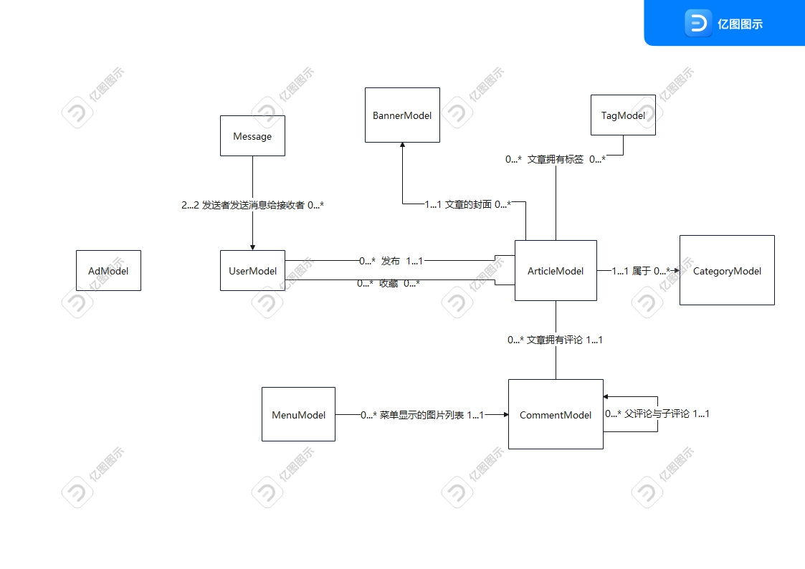

#项目主体结构


# 基本配置
## 配置文件的编写和读取

- 配置文件编写：
```mysql:
  host: 127.0.0.1
  port: 3306
  db: gin_vue_blog
  user: root
  password: root
  log_level: dev
logger:
  level: info
  prefix: '[gin_vue_blog]'
  director: log
  show-line: ture
  log-in-console: true
system:
  host: "0.0.0.0"
  port: 8080
  env: dev
```

 - 对应结构体
```
type Config struct {
	Mysql  Mysql  `yaml:"mysql"`
	//Logger Logger `yaml:"logger"`
	//System System `yaml:"system"`
}

type Mysql struct {
	Host     string `yaml:"host"`
	Port     int    `yaml:"port"`
	Db       string `yaml:"db"`
	User     string `yaml:"user"`
	Password string `yaml:"password"`
	LogLevel string `yaml:"log_level"` // 日志等级是指日志消息的重要性和优先性
}
```
 - 读取配置文件  
   使用ioutil导入配置文件，使用yaml.Unmarshal将配置文件反序列化读取到结构体中
```
package core

import (
	"fmt"
	"gin_vue_blog_AfterEnd/config"
	"gin_vue_blog_AfterEnd/global"
	"gopkg.in/yaml.v2"
	"io/ioutil"
	"log"
)

func InitConfig() {
	// 使用ioutil导入配置文件，使用yaml.Unmarshal将配置文件反序列化读取到结构体中
	const ConfigFile = "setting.yaml"
	config := &config.Config{}
	yamlConf, err := ioutil.ReadFile(ConfigFile)
	if err != nil {
		panic(fmt.Errorf("get yamlConf file error: %s", err))
	}
	err = yaml.Unmarshal(yamlConf, config)
	if err != nil {
		log.Fatalf("config Init Unmarshal: %v", err) // log.Fatalf()用于记录一条严重的错误消息，并且终止程序运行
	}
	fmt.Println("config yamlFile Init success.")
	fmt.Println(config)
	global.Config = config // 把读取到的配置文件存放到global中，配置文件应当是全局的
}
```

同时我们还需要将配置文件存入global中，因为配置文件应当是全局的，需要现在global中创建相应的结构体：

```package global

import "gin_vue_blog_AfterEnd/config"

var (
	Config *config.Config
)
```

保存的操作已经涵盖在`func InitConfig()`中了  
## 读取配置文件  
core/conf.go:
```azure
package core

import (
	"fmt"
	"gin_vue_blog_AfterEnd/config"
	"gopkg.in/yaml.v2"
	"io/ioutil"
	"log"
)

func InitConfig() *config.Config {
	// 使用ioutil导入配置文件，使用yaml.Unmarshal将配置文件反序列化读取到结构体中
	const ConfigFile = "setting.yaml"
	config := &config.Config{}
	yamlConf, err := ioutil.ReadFile(ConfigFile)
	if err != nil {
		panic(fmt.Errorf("get yamlConf file error: %s", err))
	}
	err = yaml.Unmarshal(yamlConf, config)
	if err != nil {
		log.Fatalf("config Init Unmarshal: %v", err) // log.Fatalf()用于记录一条严重的错误消息，并且终止程序运行
	}
	//fmt.Println("config yamlFile Init success.")
	return config
}

```

## gorm配置  
core/gorm.go
```azure
package core

import (
	"gin_vue_blog_AfterEnd/global"
	"gorm.io/driver/mysql"
	"gorm.io/gorm"
	"gorm.io/gorm/logger"
	"time"
)

// InitGorm gorm连接到mysql数据库
func InitGorm() *gorm.DB {
	if global.Config.Mysql.Host == "" {
		global.Log.Warnln("未配置mysql数据库，取消gorm连接")
		return nil
	}
	dsn := global.Config.Mysql.Dsn()
	// 设置mysql日志
	var mysqlLogger logger.Interface
	if global.Config.System.Env == "debug" {
		mysqlLogger = logger.Default.LogMode(logger.Info) //
	} else {
		mysqlLogger = logger.Default.LogMode(logger.Error) // 只打印错误的sql
	}

	db, err := gorm.Open(mysql.Open(dsn), &gorm.Config{
		Logger: mysqlLogger,
	})
	if err != nil {
		global.Log.Fatalf("[%s] mysql连接失败", dsn)
	}
	sqlDb, _ := db.DB()
	sqlDb.SetMaxIdleConns(10)               // 最大空闲连接数
	sqlDb.SetMaxOpenConns(100)              // 连接池最大容量
	sqlDb.SetConnMaxLifetime(time.Hour * 4) // 连接最大复用时间，不能超过mysql的wait_timeout
	return db
}

```

## 日志配置  
由于日志用到了logrus，logrus允许我们自定义日志，包括日志输出格式、日志输出位置、日志输出等级等等。一般步骤为先调用logrus库中的Formatter接口来定义自己的日志格式，然后调用logger的SetFormatter()方法来将日志格式设置为自定义格式：  
```azure
logger.SetFormatter(&MyFormatter{})
```
core/logrus.go:
```azure
package core

import (
	"bytes"
	"fmt"
	"gin_vue_blog_AfterEnd/global"
	"github.com/sirupsen/logrus"
	"log"
	"os"
	"path"
)

// 颜色
const (
	red    = 31
	yellow = 33
	blue   = 36
	gray   = 37
)

type LogFormatter struct{}

// Format 实现Formatter(entry logrus.Entry) ([]byte, error)接口方法
func (t *LogFormatter) Format(entry *logrus.Entry) ([]byte, error) {
	var levelColor int
	switch entry.Level {
	case logrus.DebugLevel, logrus.TraceLevel:
		levelColor = gray
	case logrus.WarnLevel:
		levelColor = yellow
	case logrus.ErrorLevel, logrus.FatalLevel, logrus.PanicLevel:
		levelColor = red
	default:
		levelColor = blue
	}
	var b *bytes.Buffer
	if entry.Buffer != nil {
		b = entry.Buffer
	} else {
		b = &bytes.Buffer{}
	}

	// 自定义输出日期格式
	Timestamp := entry.Time.Format("2006-01-02 15:04:05")
	if entry.HasCaller() {
		// 自定义打印调用日志的函数和行号
		funcVal := entry.Caller.Function
		// entry.Caller.File是调用函数的名称，entry.Caller.Line是调用时调用代码所在的行号
		fileVal := fmt.Sprintf("%s.%d", path.Base(entry.Caller.File), entry.Caller.Line)
		// entry.Message是调用log方法时传入函数的日志信息
		fmt.Fprintf(b, "%s [%s] \x1b[%dm%s\x1b[0m %s %s %s\n", log.Prefix(), Timestamp, levelColor, entry.Level, fileVal, funcVal, entry.Message)
	} else {
		fmt.Fprintf(b, "%s [%s] \x1b[%dm%s\x1b[0m %s\n", log.Prefix(), Timestamp, levelColor, entry.Level, entry.Message)
	}
	return b.Bytes(), nil
}

// InitLogger 返回初始化日志实例
func InitLogger() *logrus.Logger {
	log := logrus.New()
	log.SetOutput(os.Stderr)                           // 设置日志内容的输出方式
	log.SetReportCaller(global.Config.Logger.ShowLine) // 设置是否输出调用函数的名称和代码行号
	log.SetFormatter(&LogFormatter{})                  // 设置自己定义的formatter
	level, err := logrus.ParseLevel(global.Config.Logger.Level)
	if err != nil { // 如果设置文件中没有设置日志等级，就使用默认日志等级，默认日志等级为info
		level = logrus.InfoLevel
	}
	log.SetLevel(level)
	InitDefaultLogger() // 配置全局log
	return log
}

func InitDefaultLogger() {
	log := logrus.New()
	log.SetOutput(os.Stderr)                           // 设置日志内容的输出方式
	log.SetReportCaller(global.Config.Logger.ShowLine) // 设置是否输出调用函数的名称和代码行号
	log.SetFormatter(&LogFormatter{})                  // 设置自己定义的formatter
	level, err := logrus.ParseLevel(global.Config.Logger.Level)
	if err != nil { // 如果设置文件中没有设置日志等级，就使用默认日志等级，默认日志等级为info
		level = logrus.InfoLevel
	}
	log.SetLevel(level)
}

```

## 路由配置
 - 路由引擎初始化
```azure
package router

import (
	"gin_vue_blog_AfterEnd/global"
	"github.com/gin-gonic/gin"
)

type RouterGroup struct {
	*gin.RouterGroup
}

func InitRouter() *gin.Engine {
	gin.SetMode(global.Config.System.Env)
	router := gin.Default()
    
    // 路由分组
	apiRouter := router.Group("/api/")

	apiRouterGroupApp := RouterGroup{
		RouterGroup: apiRouter,
	}
	// 路由分层
	apiRouterGroupApp.SettingRouter()

	return router
}

```
值得一提的是，上面的代码还体现了路由分层和路由分组。  
在Go中，路由分层和路由分组是两个不同的概念，它们的区别如下：

路由分层（Routing Hierarchies）：指将不同的路由映射到不同的处理器函数或控制器上，以便更好地组织代码。在路由分层中，每个路由都对应一个处理器函数或控制器，用于处理该路由的请求。路由分层可以使代码更易于维护和扩展。

路由分组（Routing Groups）：指将相关的路由分组在一起，以便在它们上面执行共同的操作，例如添加中间件或共享路由参数。在路由分组中，可以将多个路由定义在同一个路由组中，并在路由组上设置中间件或路由参数，以便这些路由共享相同的中间件或参数。路由分组可以使代码更具可读性和可维护性。

简而言之，路由分层是将路由映射到不同的处理器函数或控制器上，以实现代码的组织和维护；而路由分组是将相关的路由分组在一起，以便在它们上面执行共同的操作。两者都可以使代码更易于维护和扩展。  
 - 目前具体的路由文件  
router/setting_info.go
```azure
package router

import (
	"gin_vue_blog_AfterEnd/api"
)

// SettingRouter 系统配置api
func (r RouterGroup) SettingRouter() {
	settingApi := api.ApiGroupApp.SettingApi
	r.GET("/setting/", settingApi.SettingInfoView)
}

```
 - 封装统一的路由响应
```azure
package response

import (
	"github.com/gin-gonic/gin"
	"net/http"
)

// Response 封装了一些gin公共的响应
type Response struct {
	Code int    `json:"code"`
	Data any    `json:"data"`
	Msg  string `json:"msg"`
}

const (
	Success = 0
	Error   = 7
)

func Result(code int, data any, msg string, c *gin.Context) {
	c.JSON(http.StatusOK, Response{
		Code: code,
		Data: data,
		Msg:  msg,
	})
}

func OK(data any, msg string, c *gin.Context) {
	Result(Success, data, msg, c)
}

func OKWithData(data any, c *gin.Context) {
	Result(Success, data, "操作成功", c)
}

func OKWithMessage(msg string, c *gin.Context) {
	Result(Success, map[string]interface{}{}, msg, c)
}

func FailWithCode(code ErrorCode, c *gin.Context) {
	msg, ok := CodeMessage[ErrorCode(code)]
	if ok {
		Result(int(code), map[string]interface{}{}, msg, c)
		return
	}
	Result(int(code), map[string]interface{}{}, "未知错误", c)
}

func Fail(c *gin.Context) {
	Result(Error, map[string]interface{}{}, "操作失败", c)
}

func FailWithMessage(msg string, c *gin.Context) {
	Result(Error, map[string]interface{}{}, msg, c)
}

```
以上几个函数分别是几个通用的请求响应成功和请求响应失败时向用户返回的response，将他们用函数封装起来便于调用。  
 - 错误码封装
```azure
package response

type ErrorCode int

const (
	SettingsError = ErrorCode(1001)
)

var CodeMessage = map[ErrorCode]string{
	SettingsError: "系统错误",
}

```
也可以将错误码写入json文件中，在程序开始时将json文件中保存的错误码及对应的错误码信息通过json.Unmarshall()读取到定义的map结构中，这段测试代码反应了这种方法：  
```azure
package main

import (
	"encoding/json"
	"fmt"
	"gin_vue_blog_AfterEnd/model/response"
	"io/ioutil"
)

type CodeMsg map[int]string

const FilePath = "model/response/ErrCode.json"

func main() {
	jsonFile, err := ioutil.ReadFile(FilePath)
	if err != nil {
		fmt.Println(err)
	}

	var codeMsg CodeMsg
	err = json.Unmarshal(jsonFile, &codeMsg)
	if err != nil {
		fmt.Println(err)
	}
	fmt.Println(codeMsg)
	fmt.Println(response.SettingsError)
}

```

# 搭建表结构
下面是整个项目的ER模型图：  


## 解析命令行参数  
当用户输入`go run main.go [-命令行参数]`运行时，程序根据输入的命令执行响应的函数。当用户加上`-db`时程序执行表的自动迁移
```azure
package flag

   import "flag"

type Options struct {
	DB bool
}

// Parse 解析命令参数，并对不同的命令行参数的值来执行不同的操作
func Parse() {
	dbFlag := flag.Bool("db", false, "auto migrate database")
	flag.Parse()
if *dbFlag {
		MakeMigration()
	}
}
```
## 表自动迁移  
```azure
package flag

import (
	"gin_vue_blog_AfterEnd/global"
	"gin_vue_blog_AfterEnd/model"
)

func MakeMigration() {
	var err error
	// 自定义多对多关系表
	err = global.Db.SetupJoinTable(&model.UserModel{}, "CollectModels", &model.UserCollect{})
	if err != nil {
		global.Log.Warn(err.Error())
	}
	err = global.Db.SetupJoinTable(&model.MenuModel{}, "MenuBanner", &model.MenuBanner{})
	if err != nil {
		global.Log.Warn(err.Error())
	}
	// 对模型自动迁移
	err = global.Db.Set("gorm:table_options", "ENGINE=InnoDB").
		AutoMigrate(
			&model.UserModel{},
			&model.TagModel{},
			&model.ArticleModel{},
			&model.BannerModel{},
			&model.MessageModel{},
			&model.AdModel{},
			&model.CommentModel{},
			&model.MenuBanner{},
			model.FeedbackModel{},
			model.CategoryModel{},
			model.LoginDataModel{})
	if err != nil {
		global.Log.Error(err.Error())
		return
	}
	global.Log.Info("数据表迁移成功！")
}

```

# API编写
## 配置信息API

主要的配置有 `site` `qq` `email` `qiniu` `jwt`,这里采用的做法是通过配置uri，将多个api合为一个api，有利有弊。  
利：只用编写一个api接口  
弊：接口的入参和出参不统一  

### 查询配置信息
```azure
// SettingInfoView 处理请求查看相应模块视图的函数
func (SettingApi) SettingInfoView(c *gin.Context) {
	var uri SettingUri
	err := c.ShouldBindUri(&uri)
	if err != nil {
		global.Log.Error(err.Error())
		response.FailWithMessage(err.Error(), c)
		return
	}

	switch uri.Name {
	case "site":
		response.OKWithData(global.Config.SiteInfo, c)
	case "qq":
		response.OKWithData(global.Config.QQ, c)
	case "email":
		response.OKWithData(global.Config.Email, c)
	case "qi_niu":
		response.OKWithData(global.Config.QiNiu, c)
	case "jwt":
		response.OKWithData(global.Config.Jwt, c)
	default:
		response.FailWithMessage("请输入正确的uri，“site”、“qq”、“email”、“qi_niu“或”jwt“", c)
	}
}
```

### 修改配置信息
```azure
// SettingInfoUpdate 处理修改相应模块设置参数的函数
// (注意事项) 通过指定uri以获取和修改不同模块的做法，可以减少接口数量
// 也有弊端，弊端就是接口不能统一
func (SettingApi) SettingInfoUpdate(c *gin.Context) {
	var uri SettingUri
	err := c.ShouldBindUri(&uri)
	if err != nil {
		global.Log.Error(err.Error())
		response.FailWithMessage(err.Error(), c)
		return
	}
	switch uri.Name {
	case "site":
		SiteUpdate(c)
	case "qq":
		QQUpdate(c)
	case "email":
		EmailUpdate(c)
	case "qi_niu":
		QiNiuUpdate(c)
	case "jwt":
		JwtUpdate(c)
	default:
		response.FailWithMessage("请输入正确的uri，“site”、“qq”、“email”、“qi_niu“或”jwt“", c)
	}
	core.SetYaml()
}
```
下面的五个函数针对不同的uri，对全局配置文件`global.Config`的不同模块的配置信息进行修改：  
```azure
// SiteUpdate 包含以下共5个函数分别对应修改本地全局变量`global.Config`中的不同模块
func SiteUpdate(c *gin.Context) {
	var confSiteInfo config.SiteInfo
	err := c.ShouldBindJSON(&confSiteInfo)
	if err != nil {
		//
		response.FailWithCode(response.ParameterError, c)
		return
	}
	global.Config.SiteInfo = confSiteInfo
	err = core.SetYaml()
	if err != nil {
		global.Log.Error(err.Error())
		response.FailWithMessage(err.Error(), c)
		return
	}
	response.OKWithMessage("修改成功", c)
}

func QQUpdate(c *gin.Context) {
	var confQQInfo config.QQ
	err := c.ShouldBindJSON(&confQQInfo)
	if err != nil {
		//
		response.FailWithCode(response.ParameterError, c)
		return
	}
	global.Config.QQ = confQQInfo
	err = core.SetYaml()
	if err != nil {
		global.Log.Error(err.Error())
		response.FailWithMessage(err.Error(), c)
		return
	}
	response.OKWithMessage("修改成功", c)
}

func EmailUpdate(c *gin.Context) {
	var confEmailInfo config.Email
	err := c.ShouldBindJSON(&confEmailInfo)
	if err != nil {
		//
		response.FailWithCode(response.ParameterError, c)
		return
	}
	global.Config.Email = confEmailInfo
	err = core.SetYaml()
	if err != nil {
		global.Log.Error(err.Error())
		response.FailWithMessage(err.Error(), c)
		return
	}
	response.OKWithMessage("修改成功", c)
}

func QiNiuUpdate(c *gin.Context) {
	var confQINiuInfo config.QiNiu
	err := c.ShouldBindJSON(&confQINiuInfo)
	if err != nil {
		//
		response.FailWithCode(response.ParameterError, c)
		return
	}
	global.Config.QiNiu = confQINiuInfo
	err = core.SetYaml()
	if err != nil {
		global.Log.Error(err.Error())
		response.FailWithMessage(err.Error(), c)
		return
	}
	response.OKWithMessage("修改成功", c)
}

func JwtUpdate(c *gin.Context) {
	var confJwtInfo config.Jwt
	err := c.ShouldBindJSON(&confJwtInfo)
	if err != nil {
		//
		response.FailWithCode(response.ParameterError, c)
		return
	}
	global.Config.Jwt = confJwtInfo
	err = core.SetYaml()
	if err != nil {
		global.Log.Error(err.Error())
		response.FailWithMessage(err.Error(), c)
		return
	}
	response.OKWithMessage("修改成功", c)
}
```

## 图片API
### 上传一个或多个图片  
用户上传一个或多个图片，后端返回每个图片的对应结果(因文件大小过大导致上传失败、图片保存到服务端失败、成功等等结果)：  
```azure
package image_api

import (
	"fmt"
	"gin_vue_blog_AfterEnd/global"
	"gin_vue_blog_AfterEnd/model/response"
	"github.com/gin-gonic/gin"
	"io/fs"
	"mime/multipart"
	"os"
	"path"
)

type FileUploadResponse struct {
	FileName  string `json:"file_name"`  // 上传文件名
	IsSuccess bool   `json:"is_success"` // 是否上传成功
	Msg       string `json:"msg"`        // 返回信息
}

// ImageUploadingView 上传图片并将图片保存在uploads文件夹中
func (ImageApi) ImageUploadingView(c *gin.Context) {
	form, err := c.MultipartForm()
	if err != nil {
		response.LogFail(err, c)
		return
	}
	var FileHeaderList []*multipart.FileHeader = form.File["image"]
	if len(FileHeaderList) == 0 {
		response.FailWithMessage("没有指定任何文件或者文件不存在", c)
		return
	}
	var basePath string = global.Config.SaveUpload.Path
	var size int64 = global.Config.SaveUpload.Size

	// 判断路径是否存在，如果不存在则创建
	if _, err := os.Stat(basePath); os.IsNotExist(err) { // 当前指定文件路径不存在
		err = os.MkdirAll(basePath, fs.ModePerm)
		if err != nil {
			global.Log.Error(err.Error())
		}
	}

	var upResList []FileUploadResponse = make([]FileUploadResponse, len(FileHeaderList))
	for index, FileHeader := range FileHeaderList {
		filePath := path.Join("uploads", FileHeader.Filename)
		// 判断文件大小是否大于指定最大文件大小
		if FileHeader.Size > (size << 20) {
			upResList[index] = FileUploadResponse{
				FileName:  FileHeader.Filename,
				IsSuccess: false,
				Msg:       fmt.Sprintf("上传图片大小大于设定大小，设定大小为 %d MB，当前图片大小为 %.3f MB", size, float64(FileHeader.Size)/(2<<20)),
			}
		} else {
			err = c.SaveUploadedFile(FileHeader, filePath)
			if err != nil { // 图片上传失败
				upResList[index] = FileUploadResponse{
					FileName:  FileHeader.Filename,
					IsSuccess: false,
					Msg:       fmt.Sprintf("上传图片保存到本地失败，错误信息:%s", err.Error()),
				}
			} else { // 上传成功
				upResList[index] = FileUploadResponse{
					FileName:  FileHeader.Filename,
					IsSuccess: true,
					Msg:       fmt.Sprintf("上传成功，当前图片大小为 %.3f MB", float64(FileHeader.Size)/(2<<20)),
				}
			}
		}
	}
	response.OKWithData(upResList, c)
}
```
### 白名单和黑名单(选用白名单)  
白名单和黑名单用于限制上传文件的类型：白名单指的是允许上传的文件类型列表，只有在该列表中的文件类型才能被上传，其他类型的文件则会被拒绝上传；而黑名单则是指禁止上传的文件类型列表，只有不在该列表中的文件类型才能被上传，列表中的文件类型都会被拒绝上传。  
 - 黑名单  
判断文件名后缀，如果与黑名单中的后缀符合，那就拒绝上传  
 - 白名单
判断文件名后缀，如果与白名单中的后缀符合，那就允许上传，否则拒绝上传    
```azure
// ImageWhiteList 图片上传白名单
var ImageWhiteList = []string{
	".jpg",
	".png",
	".apng",
	".jpeg",
	".tiff",
	".gif",
	".ico",
	".svg",
	".webp",
}
```

### 返回图片列表

前端请求返回图片列表，提供`pageNum`和`pageSize`参数，后端根据`pageNum`和`pageSize`对要返回的图片列表进行分页：
```azure
package image_api

   import (
	"fmt"
	"gin_vue_blog_AfterEnd/model"
	"gin_vue_blog_AfterEnd/model/response"
	"gin_vue_blog_AfterEnd/service/common_service"
	"github.com/gin-gonic/gin"
)

func (ImageApi) ImageListView(c *gin.Context) {
	var pageModel model.PageInfo
	err := c.ShouldBindQuery(&pageModel)
if err != nil {
		response.FailWithMessage(fmt.Sprintf("参数绑定失败，error：%s", err.Error()), c)
   return
      }
	var imageList []model.BannerModel
	var count int64

	// 对图片列表进行分页
	imageList, count, err = common_service.PagingList(model.BannerModel{}, common_service.PageInfoDebug{
		PageInfo: pageModel,
		Debug:    true,
	})
	response.OKWithPagingData(imageList, count, c)
return
   }
```

其中函数`common_service.PagingList`用到了泛型，对不同数据模型的数据项进行分页，从数据库中查询后返回指定页的数据列表
```azure
package common_service

   import (
	"gin_vue_blog_AfterEnd/global"
	"gin_vue_blog_AfterEnd/model"
	"gorm.io/gorm"
)

type PageInfoDebug struct {
	model.PageInfo
	Debug bool // 是否打印sql语句
}

// PagingList 对不同数据模型的数据项进行分页，返回指定页的所有数据和所有数据项的数量
func PagingList[T any](model T, debug PageInfoDebug) (list []T, count int64, err error) {
	// 对数据模型列表进行分页
	db := global.Db
if debug.Debug {
		db = global.Db.Session(&gorm.Session{Logger: global.MysqlLog})
	}
	var offset int
	count = db.Find(&list).RowsAffected
   if debug.PageNum == 0 { // 如果
		offset = 0
	} else {
		offset = (debug.PageNum - 1) * debug.PageSize
	}
	err = db.Limit(debug.PageSize).Offset(offset).Find(&list).Error
return list, count, err
}

```

其中sql实现分页的话：
```azure
// 假设一页展示`pageSize`项，当前为第pageNum页
    select * for model limit pageSize offset (pageNum-1)*pageSize
// goloang gorm
if debug.PageNum == 0 { // 如果
		offset = 0
	} else {
		offset = (debug.PageNum - 1) * debug.PageSize
	}
	err = db.Limit(debug.PageSize).Offset(offset).Find(&list).Error
return list, count, err
```
使用到了钩子函数和批量删除
### 图片删除

```azure
package image_api

import (
	"fmt"
	"gin_vue_blog_AfterEnd/global"
	"gin_vue_blog_AfterEnd/model"
	"gin_vue_blog_AfterEnd/model/response"
	"github.com/gin-gonic/gin"
)

func (ImageApi) ImageRemoveView(c *gin.Context) {
	var rmReq model.RemoveRequest
	var imageList []model.BannerModel
	var count int64 = 0

	err := c.ShouldBindJSON(&rmReq)
	if err != nil {
		global.Log.Warnln(fmt.Sprintf("参数绑定失败，请确认请求类型为JSON，error：%s", err.Error()))
		response.FailWithMessage(fmt.Sprintf("参数绑定失败，请确认请求类型为JSON，error：%s", err.Error()), c)
		return
	}

	count = global.Db.Find(&imageList, rmReq.IDList).RowsAffected
	if count == 0 { // 需要删除的图片ID没有在数据库中查到
		response.FailWithMessage("文件不存在", c)
		return
	}
	global.Db.Delete(&model.BannerModel{}, rmReq.IDList)
	response.FailWithMessage(fmt.Sprintf("删除 %d 张图片成功", count), c)
}
```

钩子函数用于处理删除本地图片的情况，本地图片需要删除数据库记录和图片在本地的存储：  
```azure
package model

import (
	"fmt"
	"gin_vue_blog_AfterEnd/global"
	"gin_vue_blog_AfterEnd/model/ctype"
	"gorm.io/gorm"
	"os"
)

type BannerModel struct {
	MODEL
	Path             string                 `json:"path"`                                // 图片URL，如果存储在本地则为图片路径，存储在云服务器上则是图片链接
	Hash             string                 `json:"hash"`                                // 图片的Hash值，用以判断重复图片
	Name             string                 `gorm:"size:36" json:"name"`                 // 图片的名称
	ImageStorageMode ctype.ImageStorageMode `gorm:"default:1" json:"image_storage_mode"` // 图片的存储方式，可以存储在本地或七牛云服务器上
}

// BeforeDelete 钩子函数，删除BannerModel记录前自动调用
func (b *BannerModel) BeforeDelete(tx *gorm.DB) (err error) {
	if b.ImageStorageMode == ctype.Local {
		// 本地图片，删除数据库存储记录，还需要删除本地的存储
		err = os.Remove(b.Path)
		if err != nil {
			global.Log.Warnln(fmt.Sprintf("本地删除图片失败，图片路径为：%s", b.Path))
			return err
		}
	}
	// 存储在云服务器上的图片则不用删除图片在云服务器上的存储
	return nil
}

```